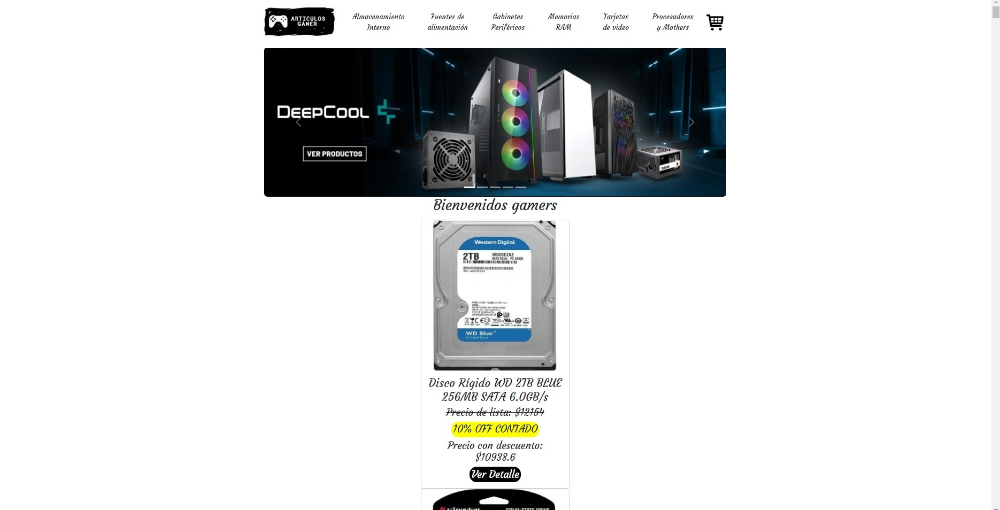
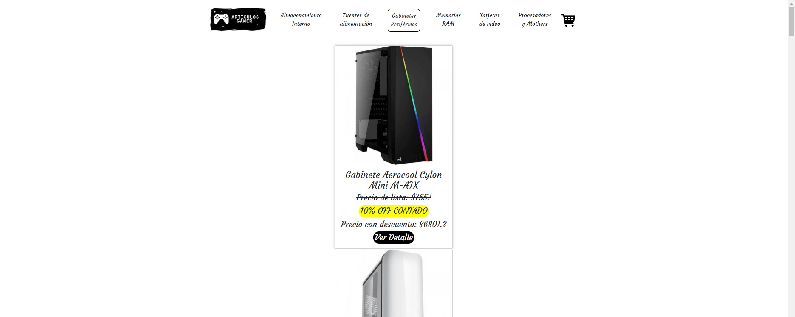
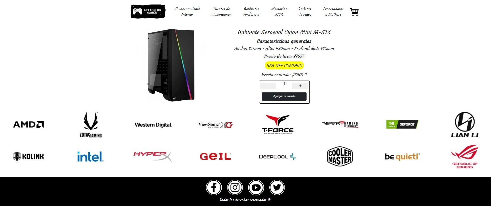
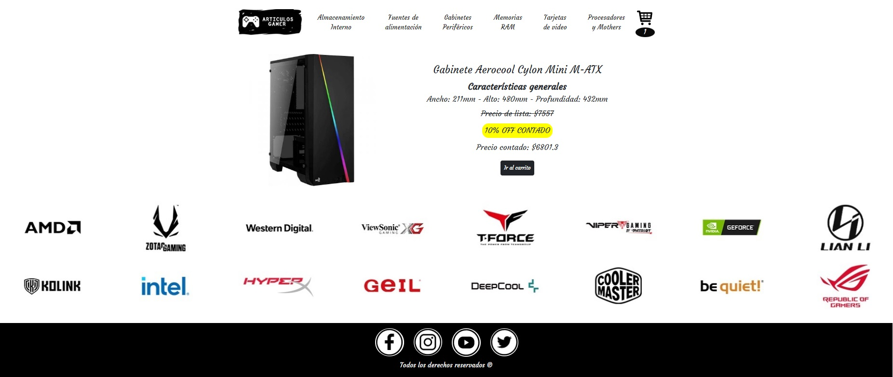
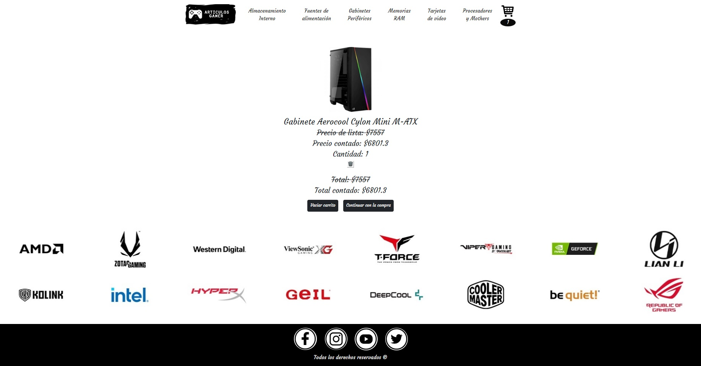
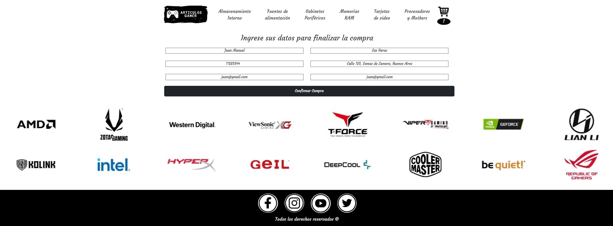

# E-commerce: Artículos Gamer

<p align="center">

</p>

Este proyecto se refiere a una tienda online de venta de artículos de computación.

Link para ver el proyecto deployado:
[articulos-gamer](http://articulos-gamer.netlify.com)

## Librerías utilizadas

- [react-router-dom](https://reactrouter.com/en/main) : Librería utlizada para la defición de rutas del proyecto
- [firebase](https://firebase.google.com/) : Librería utlizada para el almacenamiento de los productos
- [react-icons](https://react-icons.github.io/react-icons/) : Librería utilizada para añadir el ícono del carrito de compra

## Funcionalidades del proyecto

El Ecommerce permite navegar por las diferentes categorías de productos, entre ellas se encuentran: almacenamiento interno, fuentes de alimentación, gabinetes y periféricos, memorias RAM, tarjetas de video, procesadores y mothers. A la hora de estar interesado en el producto se puede ver el detalle del mismo y donde se pueden apreciar sus características generales e incluir al carrito desde una existencia hasta el límite del stock disponible (deshabilitándose el botón + hasta llegar al tope). Una vez elegido el producto y su cantidad se puede incluir al carrito haciendo click en el botón "Agregar al carrito" y se puede visualizar dicho producto en el carrito haciendo click en el botón "Ir al carrito" o desde el ícono del carrito, el cual también hará referencia de la cantidad de ítems que contiene. Finalmente, para concluir con la compra, desde el carrito, se le da click al botón "Continuar con la compra" y se redirige automáticamente a un formulario que solicita los datos personales del comprador para concluir con la transacción y asignársele su orden de compra.

## Paso a paso para dar inicio al proyecto localmente

1. Clonación del repositorio
```
git clone https://github.com/JuanMaLasH/proyecto-react-js
```
2. Instación de dependencias
```
npm install
```
3. Comienzo del proyecto en el navegador
```
npm start
```

## Vistas del paso a paso para efectuar una compra








